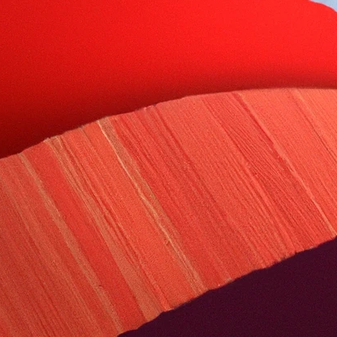
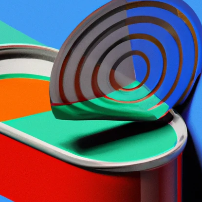
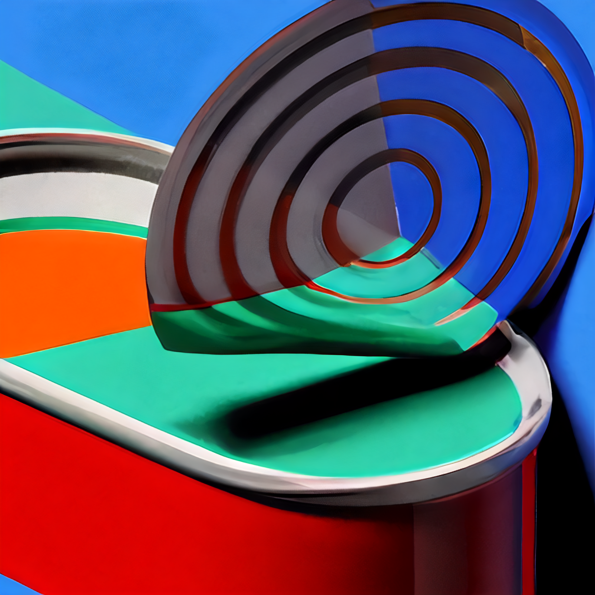

# upscale_contact_sheets
Code for generating upscaling contact sheets and example outputs

## Upscale code
To generate all upscaled images I used this [collab notebook](https://colab.research.google.com/github/olaviinha/NeuralImageSuperResolution/blob/master/SuperRes_ESRGAN.ipynb#scrollTo=tDMw6f0eXOmt)
by olaviinha.

A modified version of the [SuperRes_ESRGAN.ipynb](SuperRes_ESRGAN.ipynb) is included in this repo that can run in
[a local runtime](https://research.google.com/colaboratory/local-runtimes.html) along with the [dockerfile](Dockerfile)
I used to run it on my own hardware.

### Upscaling inputs
To make these contact sheets, I cropped out 415px x 415px sections of images and then upscaled them while setting
various settings in the above notebook. Of note, I found the results better when using dejpeg and the sharpen features,
YMMV.

#### Example inputs

#### Example outputs

## Making the contact sheets
[Upscale_contact_sheets.ipynb](Upscale_contact_sheets.ipynb) contains the code for generating the contact sheets. 
It uses as input the files in [example_inputs](example_inputs) and produces files like those found in
[example_outputs](example_outputs).

#### Example outputs
Note that differences won't be obvious unless viewed at full resolution. To better understand how these will look, they
should be viewed in their intended viewing format (e.g. computer screen, phone, print, VR, etc...)

